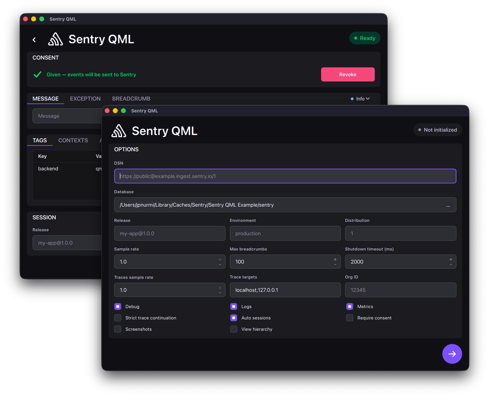

# Sentry QML

An unofficial, experimental Sentry SDK for QML, backed by:
- [Sentry Native](https://github.com/getsentry/sentry-native) for macOS, Linux, and Windows
- [Sentry Android](https://github.com/getsentry/sentry-java) for Android
- [Sentry Cocoa](https://github.com/getsentry/sentry-cocoa) for iOS, and optionally macOS
- [Sentry JavaScript](https://github.com/getsentry/sentry-javascript) for WebAssembly



## Build

```sh
git submodule update --init --recursive
cmake -B build
cmake --build build
ctest --test-dir build --output-on-failure
```

## Example

```sh
./build/example/sentry_qml_example
```

The example runs from the build tree without installing the QML module.

## Backends

The default backend is inferred from the target platform: `android` on Android,
`cocoa` on iOS, `wasm` on WebAssembly, and `native` elsewhere. Override it with
`-DSENTRY_BACKEND=<backend>`.

For sentry-native builds, values such as `crashpad`, `breakpad`, `inproc`, and
`none` select the native crash backend.

## Android

Use a Qt for Android toolchain. App targets that link `SentryQml` must call:

```cmake
sentry_qml_configure_android_target(your_app_target)
```

This adds the Java bridge and the `io.sentry:sentry-android` Gradle dependency.
Override the default dependency with `-DSENTRY_ANDROID_VERSION=<version>` or
`-DSENTRY_ANDROID_GRADLE_COORDINATE=<coordinate>`.

## WebAssembly

Use a Qt for WebAssembly toolchain. The generated page must load the Sentry
JavaScript SDK before QML calls `Sentry.init(...)` and expose it as
`globalThis.Sentry`.

The browser JavaScript backend does not support native crash capture.

## iOS

Use a Qt for iOS toolchain and the Xcode generator. Sentry Cocoa requires an iOS
deployment target of 15.0 or higher. App targets that link `SentryQml` must call:

```cmake
sentry_qml_configure_ios_target(your_app_target)
```

This embeds and signs the selected `SentryObjC-Dynamic.xcframework` slice. To
use a prebuilt XCFramework instead of `modules/sentry-cocoa`, pass:

```sh
-DSENTRY_COCOA_XCFRAMEWORK=/path/to/SentryObjC-Dynamic.xcframework
```
